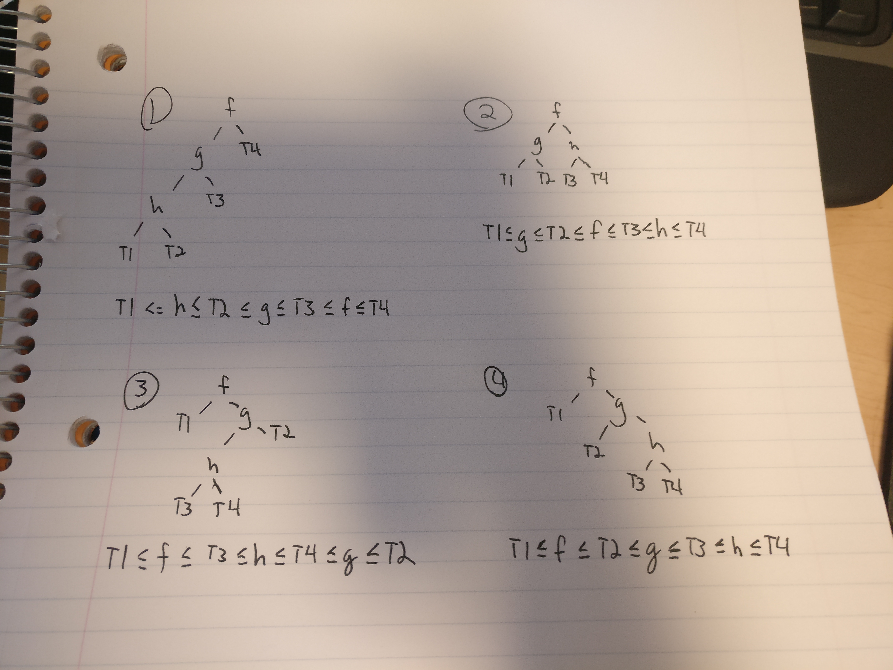
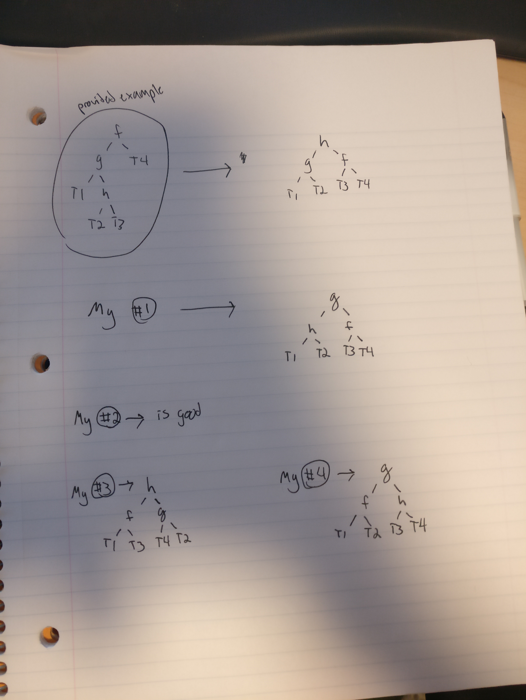

# FOCS Homework 15, for Day 15

You may edit your answers into this file, or add a separate file in the same directory.

If you add a separate file, please include the following at the top:

```
Student Name: Griffin Tschurwald [change to your name]
Check one:
[X] I completed this assignment without assistance or external resources.
[ ] I completed this assignment with assistance from ___
   and/or using these external resources: ___
```


## I. Binary search tree ordering


Assume that the following tree structures are all properly constructed binary search trees, preserving the binary search property that any (internal) node's left child is smaller than the internal node and its right child is larger (or of equal value).  

Anything labeled with a T can be assumed to be a (possibly empty) subtree (i.e., may contain zero or more nodes); anything labeled with a lower case letter is a single node.

What inequalities must hold in each of these trees?

### 0.
```
        a
       / \
      /   \
    T1     T2
```

Ans:  all elements of TI <= x <= all elements of T2

### 1.
```
        b
       / \
      /   \
     c     T3
    / \
   /   \
 T1    T2
```

Ans: T1 <= c <= T2 <= b <= T3


### 2.
```
        d
       / \
      /   \
    T1     e
          / \
         /   \
       T2    T3
```

Ans: T1 <= d <= T2 <= e <= T3


### 3.
```
        f
       / \
      /   \
     g     T4
    / \
   /   \
 T1     h
       / \
      /   \
    T2     T3
```

Ans: T1 <= g <= T2 <= h <= T3 <= f <= T4


## II.  Extending this analogy:  drawing trees.

### 4. 

What other tree structures containing three internal nodes -- x, y, and z -- can exist?  Draw these and describe the inequalities that exist among the internal nodes and their subtrees.  
[Hint:  There should be four more shapes.]  
The relationship among x, y, and z doesn't matter.  For convenience, we've arbitrarily labeled them top to bottom and the subtrees left to right.

   Image should appear here, it's also in the repository.



<expand as needed>


## III.  Observing balance

It is desirable for binary search trees to be balanced (or close).  If we assume that each of the T structures has the same depth, the two-internal-node trees have the following property:

For EVERY internal node (x and y), the depth of the internal node's left subtree and the depth of the internal node's right subtree differ by at most 1.  We call these trees almost-balanced.  


### 5. 

Does this property hold for any of the three-internal-node trees?  Which ones?  Which ones are NOT almost-balanced?  (We call these unbalanced.)

This property only holds for tree #2 in my answer. All the rest are not almost-balanced.  

## IV.  Maintaining balance


Observe the following:

If you are given a binary tree of the form in question 1, you can transform them into the form in question 2 (and vice versa) while preserving the binary search property.  
[Since they are both almost-balanced, this doesn't help, but it also doesn't hurt.]  

### 6. 

Use this insight to show how to modify each of the unbalanced tree forms with three internal nodes into an almost-balanced tree that preserves the binary search property.


   Image should appear here, it's also in the repository.


## V.  Rebalancing

### 7. 

Verify that the following tree is almost-balanced:

For EVERY internal node (x and y), the depth of the internal node's left subtree and the depth of the internal node's right subtree differ by at most 1. 

```
         8
        / \
       /   \
      6     14
     /\      /\  
    /  \    /  \ 
   3   7   12   16  
  /\       /    /\ 
 /  \     /    /  \ 
2    5   10   15   20
                   /
                  /
                 18
```

Here I'll put the internal node, and depth of both subtrees - example is 8[3,4]
8[3,4]
6[2,1]
3[1,1]
14[2,3]
16[1,2]
20[1,0]

### 8. 

Insert the value 13 into this tree.  Where does it go?  Is the resulting tree almost-balanced?  If not, see #11.

```
         8
        / \
       /   \
      6     14
     /\      /\  
    /  \    /   \ 
   3   7   12    16  
  /\       /\     /\ 
 /  \     /  \   /  \ 
2    5   10  13 15   20
                     /
                    /
                   18
```
still almost-balanced

### 9. 

Insert the value 17 into the tree.  Where does it go?  Is the resulting tree almost-balanced?  If not, see #11.

```
         8
        / \
       /   \
      6     14
     /\      /\  
    /  \    /   \ 
   3   7   12    16  
  /\       /\     /\ 
 /  \     /  \   /  \ 
2    5   10  13 15   18
                     /\
                    /  \
                   17   20
```

still balanced

### 10. 

Insert the value 4 into the tree.  Where does it go?  Is the resulting tree almost-balanced?  If not, see #11.

```
         8
        / \
       /   \
      6     14
     /\      /\  
    /  \    /   \ 
   3   7   12    16  
  /\       /\     /\ 
 /  \     /  \   /  \ 
2    5   10  13 15   18
                     /\
                    /  \
                   17   20
```

### 11. 

Use the work you've done above to rebalance the tree.  Start at the newly inserted value; work up until you find an internal node that has left and right children whose depth differs by more than one.  Rebalance that subtree using the processes you created in #6.  Continue to climb the tree, rebalancing any unbalanced (not almost-balanced) nodes as you go up.

The trees are all balanced, so I don't think I need to do this step.

### 12. 

[Challenge] Assuming that a tree is almost-balanced when you make an insertion, and that that insertion may violate the almost-balanced property, can almost-balance always be restored solely by climbing the  path from the newly inserted node to the root?  Will you ever have to descend another branch?  Why or why not?


